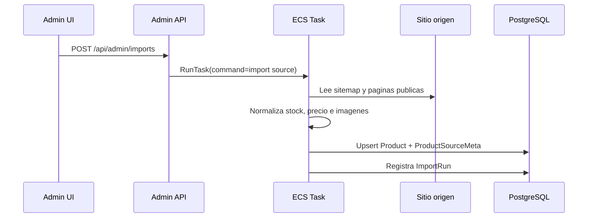
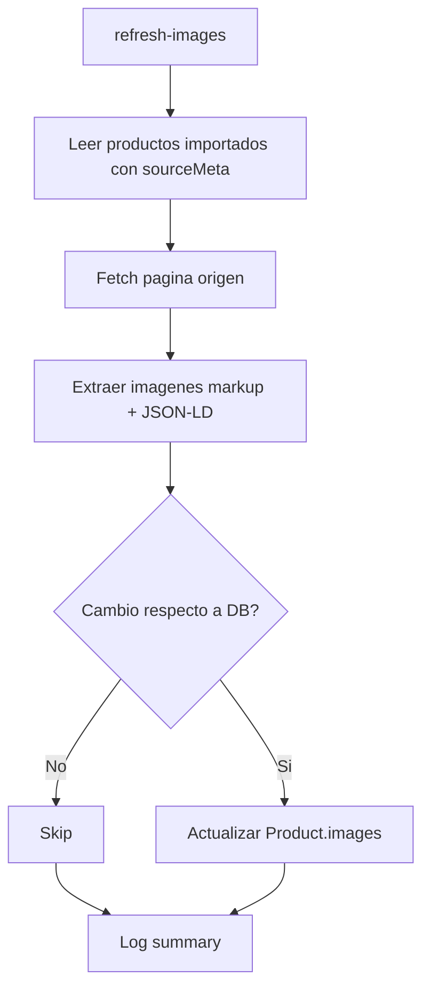
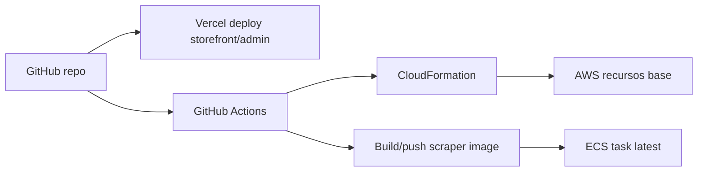

# Diagramas

## Arquitectura general

```mermaid
flowchart LR
    User["Cliente / Admin"] --> Storefront["Vercel - Storefront Next.js"]
    User --> Admin["Vercel - Admin Next.js"]
    Storefront --> DB["PostgreSQL"]
    Admin --> DB
    Admin --> ECS["AWS ECS Fargate"]
    ECS --> DB
    ECS --> Merlin["merlingrow.com"]
    ECS --> Dutch["dutch-passion.ar"]
    EventBridge["AWS EventBridge"] --> ECS
    ECR["AWS ECR"] --> ECS
    Secrets["AWS Secrets Manager"] --> ECS
    SSM["AWS SSM Parameter"] --> ECS
    Logs["CloudWatch Logs"] <-- ECS
```

## Flujo de importacion



## Flujo de refresco de imagenes



## Relacion de despliegue


